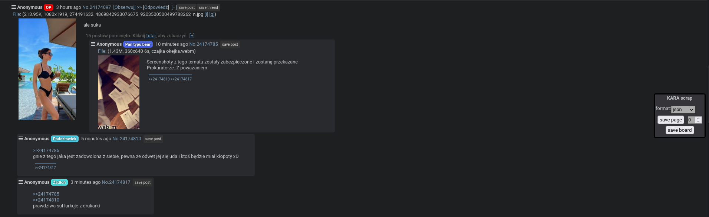

# KARAscrap


## HOW TO SETUP:
- clone repo to your device
- copy content of js.js file and paste it into custom js section in karachan.org
- configure host and port variable in js.js file and make sure that it matches your python script argument host and port

## HOW TO USE:
```
python3 ./main.py <host> <port> <save location>
```
example:

```
python3 ./main.py localhost 1488 archive
```

